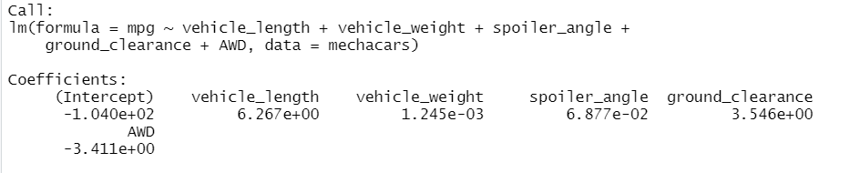
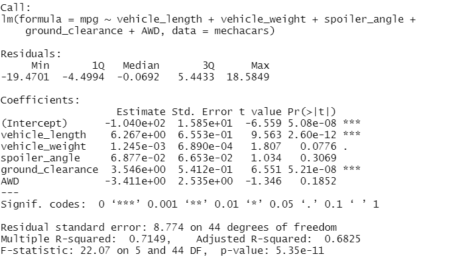
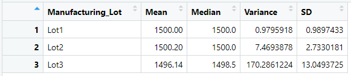
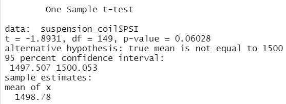
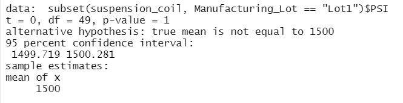
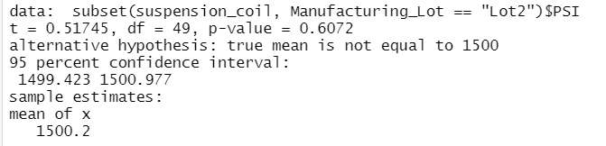
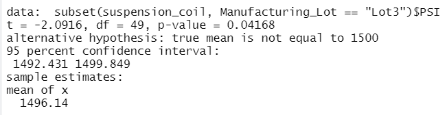

# MechaCar Statistical Analysis

## Linear Regression to Predict MPG

- Which variables/coefficients provided a non-random amount of variance to the mpg values in the dataset?  

Vehicle length and ground clearance both provided a non-random amount of variance to the mpg values. As seen in Figure 1, these two variables were the only ones that were not statistically insignificant.

#### Figure 1: Total Summary
  

- Is the slope of the linear model considered to be zero? Why or why not?  

The slope of the linear model is not considered to be zero. In Figure 2, we see "Multiple R-squared: 0.7149." This means that about 71% of the variability of the dependent variable (mpg predictions) is explained using this linear model. For the slope of the model to be considered zero, the value would have to be less than 5%.

#### Figure 2: Lot Summary

- Does this linear model predict mpg of MechaCar prototypes effectively? Why or why not?  

This linear model predicts mpg of MechaCar prototypes effectively with an R-squared value of 71%.

## Summary Statistics on Suspension Coils 
- The design specifications for the MechaCar suspension coils dictate that the variance of the suspension coils must not exceed 100 pounds per square inch. Does the current manufacturing data meet this design specification for all manufacturing lots in total and each lot individually? Why or why not?  

The current manufacturing data suggests that the design specification is met for all manufacturing lots in total. In Figure 3, we see that the total variance is approximately 62.29 PSI.

Each lot individually tells a different story. Lots 1 and 2 are in compliance with a variance of 0.98 and 7.47 PSI respectively, but Lot 3 is out of scope with a variance of 170.29 PSI (Figure 4).  

#### Figure 3: Suspension Coil PSI Total Summary

#### Figure 4: Suspension Coil PSI by Lot

## T-Tests on Suspension Coils

A t-test was conducted on all lots, and on each lot individually. 

#### Figure 5: T-Test (All Lots)

t = -1.8931, indicating a negative relationship.

#### Figure 6: T-Test (Lot 1)

t = 0, indicating no relationship.

#### Figure 7: T-Test (Lot 2)

t = 0.51745, indicating a positive relationship.

#### Figure 8: T-Test (Lot 3)

t = -2.0916, indicating a negative relationship.

## Study Design: MechaCar vs Competition

In addition to mpg, another metric of interest to study is that of MechaCar ground clearance height and its relationship with maintenance costs, compared to that of the competition.  A possible null and alternate hypothesis combination is as follows:

- Null Hypothesis: Ground clearance height has no effect on annual maintenance costs.
- Alternate Hypothesis: Ground clearance height has an effect on annual maintenance costs.

A one-sample t-test would best be used in this situation, since we would be trying to determine whether there is a statistical difference between an observed sample mean and its presumed population mean.  

In order to conduct this statistical test, we would need to collect data on the total annual maintenance costs of MechaCars as well as by Lot.